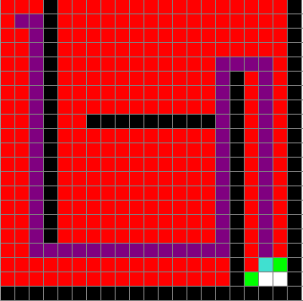

# Astar - dokumentasjon
<hr>

I denne innleveringen er vi blitt bedt om å skrive en implementasjon av A*, en søkealgoritme som er godt egnet for å finne korteste vei fra punkt A til B. Tidligere har vi jobbet med Dijkstra, og oppgaven som vi har fått utlevert er allerede implementert med denne algoritmen. Jeg skal først fortelle litt om forskjelligen på de to algoritmene, pluss en variant som heter Gready Best First, senere gå igjennom koden som jeg har skrevet for A*.

[](https://www.youtube.com/watch?v=F_0u5ygxx4I)

https://www.youtube.com/watch?v=F_0u5ygxx4I

Video som viser hvordan dette scriptet kjøres. Denne kan gjerne kjøres i dobbelt tempo. Mac og Pygame spiller ikke veldig godt på lag, og det gjør at programmet kjører ulidelig sakte.

<hr>


## *"Dijkstra"* vs *"Gready Best First"* vs *"Astar"* 
Alle tre algoritmer benytter seg av en prioriteringskø ved at nodene som skal undersøkes legges inn i køen. Pseudokode for algoritmen kan se slik ut:

- Legg startnoden i køen
- while True:
	- hent node fra køen
	- hvis noden er lik slutt node
		- avslutt whileløkka
	- for hver nabonode i noden
		- hvis nabonodens distanse er større enn nodens distanse + naboens vekt
			- rekalkuler nabonodens data
			- legg nabonoden til i køen


Køen fungerer slik at noden som til enhver til skal undersøkes plukkes fra denne, og naboer til noden som besøkes legges inn i køen for å senere bli undersøkt. *Forskjellen på de tre metodene er i hovedsak hvordan denne køen prioriteres.* I Dijkstra vil køen vektlegges på bakgrunn av kostnad, lavere kostnad betyr å komme lenger fram i køen og dermed bli undersøkt tidligere enn noder med høy kostnad. I Gready Best First vil avstanden fra node til målet (heuristic) bestemme prioriteten i køen. Med A* så kombinerer vi begge metodene og lar avstand *og* kostnad bestemme prioritet i køen. 

Denne forskjellen på hvordan køen vektlegges gir utslag på hvordan søket til syvende og sist ser ut. Alle tre *kan* gi raskeste vei, men det er ikke alltid slik. Her er eksempler på alle de tre forskjellige algoritmene i rekkefølge, Dijkstra, Gready og A*. Her er det relativt enkelt å se at A* er en kombinasjon av de to første. 

            ![[Bilder/astar.png|200]]

Selv om det kan se ut som alle vil gi det samme resultatet så kommer det ann på hvordan topografien i et søk ser ut. På bildet under til venstre kan du se at Gready Best *ikke* gir korteste vei. Topografien er altså utformet slik at søket ender med å hoppe over de nodene som er nødvendige for å finne den korteste ruta. Til høyre ser du samme topografi men med A*.

![[Bilder/greadybestgonewrong.png|250]]      ![[Bilder/astarsavestheday.png|250]]

Så hvilken av disse algoritmene som er best avhenger av situasjon og behov. Dijkstra vil alltid velge kjappeste vei, men er ressurskrevende pga. antall noder som besøkes. Gready Best vil i bestemte tilfeller finne målet raskest, men ruta vil ikke nødvendigvis være kortest. Astar er et kompromi hva hastighet/ressurs angår, men vil finne beste vei på lik linje med Dijkstra.

<hr>

# Innlevert kode forklart

Under her ser du koden som er levert i AStar.py. Detaljene er forklart . 

```python
def AStarSearch(self, startVertexName=None, targetVertexName=None):
	self.initPygame()
	from heapdict import heapdict
	  
	# This is D form <def heustistics()>. Fiddeling with it makes it possible to get it slightly better.
	D = 1.05
	  
	# Reset g and f properties to infinity, set h to heuristic distance to target.
	for node in self.vertecies:
		self.vertecies[node].h = self.heuristics(self.vertecies[node].name, targetVertexName)
		self.vertecies[node].g = float("inf")
		self.vertecies[node].f = float("inf")
		
	# Check to see that startvertex is in Graph
	if startVertexName not in self.vertecies:
		raise KeyError("Start node not present in graph")
	
	# Reset visited and previous pointer before running algorithm
	current_node = self.vertecies[startVertexName]
	current_node.g = 0
	start_node = self.vertecies[startVertexName]
	to_node = self.vertecies[targetVertexName]
	
	pq = heapdict()
	pq[current_node] = 0 # Sets first element in pq with priority 0
	
	while pq:
		# Get the element with lowest priority (i.e. weight on edge)
		current_node = pq.popitem()[0]
		# Break out if goal is reached...
		if current_node.name == targetVertexName:
			break
			
		# Oppdaterer PyGame
		self.pygameState(current_node, self.GREEN)
		self.pygameState(start_node, self.BLUE)
		self.pygameState(to_node, self.RED)
		
		for neighbor in current_node.adjecent:
			if neighbor.vertex.g > (current_node.g + neighbor.weight):
				neighbor.vertex.g = current_node.g + neighbor.weight
				neighbor.vertex.f = neighbor.vertex.g + (D * neighbor.vertex.h)
				neighbor.vertex.previous = current_node
				pq[neighbor.vertex] = neighbor.vertex.f
				
				# Oppdaterer PyGame
				self.pygameState(neighbor.vertex, self.PINK)
		# Oppdaterer PyGame	
		self.pygameState(current_node, self.LIGHTGREY)
	  
	for n in self.getPath(startVertexName, targetVertexName):
		self.pygameState(n, self.DARKGREEN)
	return self.getPath(startVertexName, targetVertexName)
```

<hr>

## Metode, pygame init og imports
```python
def AStarSearch(self, startVertexName=None, targetVertexName=None):
	self.initPygame()
	from heapdict import heapdict
```
Her settes metoden opp med args som skal være startnoden og sluttnoden. Pygame initialiseres og heapdict importeres for senere bruk.


## Finjustering...
```python
# This is D form <def heustistics()>. Fiddeling with it makes it possible to get it slightly better.
	D = 1.05
```
Metoden *heuristics()* i AStar.py har en konstantverdi D som er satt til 1. Ved å justere denne verdien kan man justere hvor mye prioritetsverdien (f) vektlegges. Dersom verdien økes så vil avstanden som beregnes bli høyere og noden vil havne lenger bak i køen, altså få lavere prioritet.


## Setter initialverdi til h, g og f
```python
# Reset g and f properties to infinity, set h to heuristic distance to target.
	for node in self.vertecies:
		self.vertecies[node].h = self.heuristics(self.vertecies[node].name, targetVertexName)
		self.vertecies[node].g = float("inf")
		self.vertecies[node].f = float("inf")
```

### h
Denne verdien forandrer seg aldri underveis i kalkulasjonen og *kan* dermed settes på forhånd slik at den ikke trengs å kjøres som en del av loopen. For-løkka kjører igjennom alle oppgitte noder og setter disse verdiene. Dette får animasjonen til å gå marginalt fortere på min mac. Det er verdt å nevne at i normale tilfeller så er det meningen at denne verdien også regnes underveis slik at man ikke behøver å regne ut verdien på ubesøkte noder. I vårt tilfelle er antallet node begrenset, så derfor har jeg valgt å inkludere denne initielt.

### g og f
Disse settes til float("inf"), dermed er det mulig å bruke disse verdiene som en sjekk for om noden har vært besøkt eller ikke. "self.known" i Vertex.py blir da overflødig og trengs ikke.


## Sanity check og startverdier
```python
# Check to see that startvertex is in Graph
	if startVertexName not in self.vertecies:
		raise KeyError("Start node not present in graph")
		
# Reset visited and previous pointer before running algorithm
	current_node = self.vertecies[startVertexName]
	current_node.g = 0
	start_node = self.vertecies[startVertexName]
	to_node = self.vertecies[targetVertexName]
	
	pq = heapdict()
	pq[current_node] = 0 # Sets first element in pq with priority 0
```

Øverste to linjer er kun en sanity-sjekk for å se om startverdien er å finne i dictionary fra vertecies oppgitt. Dersom den ikke finnes avsluttes scriptet med feilmelding.

Resten oppretter variabler som brukes innad i metoden. *Current_node's* attributt *g* settes til 0 slik at første sammenligning under vil resultere i at den første if-setningen vil være true. Her initialiseres også *heapdict* som variabel *pq*. Første element som legges inn er *current_node* med en prioritet på 0. Det har ikke egentlig noe å si hvilken prioritet denne får, da den som eneste element i køen vil velges uansett.


## While løkka
*(selve søkealgoritmen...)*

### A
```python
		current_node = pq.popitem()[0]
```
Det første som skjer i løkka er at elementet med lavest prioritetsverdi (f) bli hentet ut. Når verdien poppes vil både noden og prioritet komme ut som en tuple slik: *(node, prioritet)*. Selve prioritetsverdien er kun for at heapdict skal sortere elementer som legges inn, så det eneste som trengs er noden som er assosiert med prioritetsverdien. Dette blir current_node.

### B
```python
		# Break out if goal is reached...
		if current_node.name == targetVertexName:
			break
			
		# Oppdaterer PyGame
		self.pygameState(current_node, self.GREEN)
		self.pygameState(start_node, self.BLUE)
		self.pygameState(to_node, self.RED)
```
De neste to linjene er en ny sanity-check. Dersom navnet til current_node er det samme som target har vi nådd målet og loopen kan avbrytes. Dersom current_node ikke er lik går vi videre og pygame oppdaterer grafikken.

### C
```python
		for neighbor in current_node.adjecent:
```
*current_node.adjecent* er en dictionary med alle noder som grenser til current_node. Her starter vi å iterere oss gjennom alle disse. Normalt sett vil det være to eller tre slike noder å kjøre gjennom.

### C1
```python
			if neighbor.vertex.g > (current_node.g + neighbor.weight):
```
Dersom distansen til nabo-noden som sjekkes er større enn currents nåværende *pluss* nabo-nodens vekt så oppdateres nabo-nodens g og f.

### C2
```python
				neighbor.vertex.g = current_node.g + neighbor.weight
				neighbor.vertex.f = neighbor.vertex.g + (D * neighbor.vertex.h)
				neighbor.vertex.previous = current_node
```
Her oppdateres g og f, og nabo-nodens previous attributt settes til *current_node*

### C3
```python
				pq[neighbor.vertex] = neighbor.vertex.f
```
*Kun* dersom nabo-noden har blitt oppdatert legges den inn i køen, og her vil da køen automatisk sørge for at den noden som legges inn med lavest prioritet (f = h+g) vil hentes ut først når vi returnerer til A.

### C4
```python
				# Oppdaterer PyGame
				self.pygameState(neighbor.vertex, self.PINK)
		# Oppdaterer PyGame	
		self.pygameState(current_node, self.LIGHTGREY)
```
Så oppdateres pygames grafikk igjen. og whileløkka fortsetter fra A

## Til slutt
```python
	for n in self.getPath(startVertexName, targetVertexName):
		self.pygameState(n, self.DARKGREEN)
	return self.getPath(startVertexName, targetVertexName)
```
Når vi treffer sanity check i B og bryter ut av while-løkka, kjøres denne lille biten med kode som ved hjelp av getpath() itererer seg gjennom baklengs gjennom nodene ved å se på hvilke noder som ligger i self.previous til en node. getpath() returnerer en liste som denne forløkka skriver ut på canvaset til Pygame ved hjelp av fargen darkgreen.
